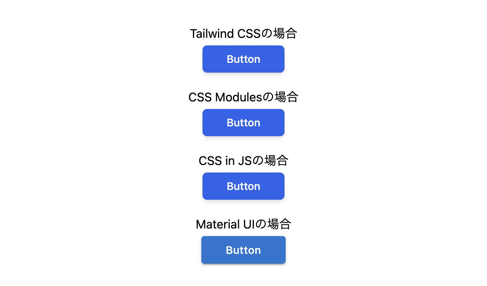

## 概要

フロントエンドの技術選定のために、以下の 3 種類を比較しました。  
それぞれ矢印の後ろに書いてあるファイルでソースが確認できます。

- [Tailwind CSS](https://tailwindcss.com/) → src/App.tsx
- CSS Modules
  → src/components/ButtonCSSModules.tsx, src/components/ButtonCSSModules.tsx
- CSS in JS ([emotion](https://emotion.sh/docs/introduction)) → src/components/ButtonCSSinJS.tsx



## Getting Started

```
npm install
npm run dev
```

上記の画像のように単純にボタンが並んでるだけなので、npm install するまでもないと思いますが、一応書いておきます 😅
